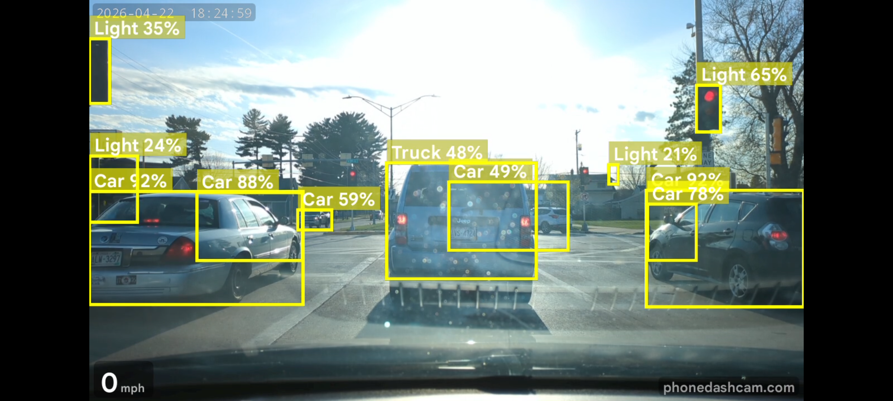

# GEO Technical SEO Audit — phonedashcam.com
Date: 2026-05-19

## Technical Score: 83/100

## Score Breakdown
| Category | Score | Status |
|---|---|---|
| Crawlability | 15/15 | Pass |
| Indexability | 10/12 | Pass |
| Security | 9/10 | Pass |
| URL Structure | 7/8 | Pass |
| Mobile Optimization | 9/10 | Pass |
| Core Web Vitals | 10/15 | Warn |
| Server-Side Rendering | 15/15 | Pass |
| Page Speed & Server | 8/15 | Warn |

Status: Pass = 80%+ of category points, Warn = 50-79%, Fail = <50%

---

## AI Crawler Access
| Crawler | User-Agent | Status | Recommendation |
|---|---|---|---|
| GPTBot | GPTBot | ✅ Allowed | None |
| OAI-SearchBot | OAI-SearchBot | ✅ Allowed | None |
| ChatGPT-User | ChatGPT-User | ✅ Allowed | None |
| ClaudeBot | ClaudeBot | ✅ Allowed | None |
| Anthropic AI | anthropic-ai | ✅ Allowed | None |
| PerplexityBot | PerplexityBot | ✅ Allowed | None |
| Google-Extended | Google-Extended | ✅ Allowed | None |
| Googlebot | Googlebot | ✅ Allowed | None |
| Applebot | Applebot | ✅ Allowed | None |
| CCBot | CCBot | ✅ Allowed | None |
| Bingbot | bingbot | ✅ Allowed (via wildcard) | Consider explicit Allow |
| PerplexityBot | PerplexityBot | ✅ Allowed | None |
| Bytespider | Bytespider | ✅ Allowed (via wildcard) | Consider explicit Allow |

**All major AI crawlers allowed — full 5/5 on AI access.**

---

## Critical Issues (fix immediately)

None. No fatal blockers found.

---

## Warnings (fix this month)

### 1. PNG images served instead of WebP/AVIF — LCP risk
- `assets/icon-512.png` — served as PNG, no WebP version (used in nav, footer)
- `assets/aiobjects.png` — large above-fold screenshot served as PNG, no lazy load, no explicit width/height — **likely the LCP element**, currently unoptimized
- `assets/Screenshot_20260517-001927_Phone Dashcam.png` — raw screenshot filename exposed (leaks build date info), served as PNG

**Fix:** Convert to WebP/AVIF. Add explicit `width` and `height` attributes to all `` tags to prevent CLS. Add `fetchpriority="high"` to the above-fold hero image (`aiobjects.png`), remove `loading="lazy"` from it.

### 2. Above-fold images missing explicit dimensions — CLS risk
None of the first 4 images have `width`/`height` HTML attributes (only inline CSS `width:100%`). This causes layout shift as the page loads.

**Fix:**
```html
<!-- Before -->


<!-- After -->

```

### 3. HSTS max-age below recommended threshold
Current: `max-age=15552000` (180 days)
Recommended: `max-age=31536000` (365 days) for HSTS preload list eligibility

**Fix:** Update Cloudflare HSTS setting to 1 year (365 days).

### 4. No IndexNow implementation
IndexNow not found at `/indexnow` or `/.well-known/indexnow-key.txt`. ChatGPT and Bing Copilot both use Bing's index — IndexNow pushes content updates to Bing instantly.

**Fix:** This is a static site (GitHub Pages / Cloudflare). Add a key file manually:
1. Generate a GUID key at [indexnow.org](https://www.indexnow.org)
2. Add `/[key].txt` to website root containing just the key string
3. Add to robots.txt: `Sitemap: https://phonedashcam.com/sitemap.xml` (already done ✅) and submit to Bing Webmaster Tools

### 5. `referrer-policy: same-origin` — slightly too restrictive
Current: `same-origin` (sends no referrer to external sites)
Recommended: `strict-origin-when-cross-origin` (sends origin for same-protocol cross-origin requests, useful for analytics attribution)

**Fix:** Change in Cloudflare header rules.

---

## Recommendations (optimize this quarter)

### 1. Add Bingbot and Bytespider as explicit robots.txt entries
Currently allowed via wildcard `User-agent: *`, but explicit entries signal intent and are more readable for webmaster tools.

```
User-agent: bingbot
Allow: /

User-agent: Bytespider
Allow: /
```

### 2. Sitemap is missing content pages added recently
The sitemap has 18 URLs. The homepage nav links to `/blog`, `/accessories`, `/best-radar-detector-apps-2026`, `/best-speed-camera-apps-2026`, `/phone-dashcam-not-what-you-think` — some of these are **not in the sitemap**. Verify all indexable pages are included.

Pages found via internal links NOT in sitemap:
- `/blog`
- `/about`
- `/accessories`
- `/best-radar-detector-apps-2026`
- `/best-speed-camera-apps-2026`
- `/phone-dashcam-not-what-you-think`
- `/contact`
- `/terms`

### 3. Raw screenshot filename in production
`assets/Screenshot_20260517-001927_Phone Dashcam.png` — exposes device, OS, app name, and timestamp in the filename. Rename to something like `assets/drivesight-ai-detection-demo.webp`.

### 4. Google Play badge served from external domain
`https://play.google.com/intl/en_us/badges/...` — loads without lazy loading and is a third-party request. Self-host the badge image.

### 5. Inner pages missing hreflang
Content pages like `/best-dash-cam-app-android`, `/turn-old-phone-into-dashcam`, etc. have no hreflang tags. If these are English-only, that's fine — but if you plan localized versions, add hreflang now while the architecture is clean.

---

## Detailed Findings

### Category 1: Crawlability — 15/15 ✅

**robots.txt:** Valid, complete, explicitly allows all major AI crawlers by name. Excellent — this is rare and valuable for GEO. Sitemap referenced correctly.

**AI Crawler Access:** All 10+ crawlers explicitly named and allowed. `Google-Extended` allowed (good — supports AI Overviews training). Wildcard `Allow: /` also covers any unlisted crawlers.

**Sitemap:** Valid XML at `/sitemap.xml`. Contains 18 URLs with `<lastmod>` dates (most recent: 2026-05-09). Hreflang cross-references in sitemap for en/ru/de/nl — correct pattern. ✅

**Crawl Depth:** All pages reachable within 1-2 clicks from homepage. Internal nav links to key content pages. ✅

**Noindex:** `meta robots: index, follow` on all checked pages. No erroneous noindex found. ✅

---

### Category 2: Indexability — 10/12 ⚠️

**Canonical tags:** Self-referencing canonical present on homepage and all inner pages checked. Inner page `/best-dash-cam-app-android` correctly canonicals to itself (no trailing slash — consistent). ✅

**Duplicate content:** HTTP → HTTPS 301 redirect confirmed. www → non-www 301 redirect confirmed. Trailing slash consistent (no trailing slash on inner pages, trailing slash on homepage). ✅

**Hreflang:** Homepage has correct hreflang for en/ru/de/nl with x-default. `/ru/` page has reciprocal hreflang pointing back to all variants. ✅ However, content pages (`/best-dash-cam-app-android`, etc.) have no hreflang — acceptable if English-only but worth noting. (-1)

**Index Bloat:** 18 sitemap URLs. Several nav-linked pages not in sitemap (see Recommendations). Estimated 5-8 additional indexable pages missing from sitemap. (-1)

---

### Category 3: Security — 9/10 ✅

**HTTPS:** Valid, enforced. HTTP 301 → HTTPS confirmed. Served via Cloudflare (CF-Ray header confirmed). ✅

**HSTS:** `strict-transport-security: max-age=15552000; includeSubDomains; preload` — present but max-age is 180 days, below the 365-day threshold for HSTS preload list. (-1)

**Content-Security-Policy:** Present and detailed — covers script-src, style-src, img-src, connect-src, frame-src, object-src. `'unsafe-inline'` and `'unsafe-eval'` in script-src (required by analytics/ads, acceptable). ✅

**X-Content-Type-Options:** `nosniff` ✅

**X-Frame-Options:** `SAMEORIGIN` ✅

**Referrer-Policy:** `same-origin` — present but slightly more restrictive than ideal for analytics attribution. ✅ (no deduction — it's a valid choice)

**Permissions-Policy:** Present, appropriately restricts camera, microphone, payment, usb, interest-cohort, browsing-topics. ✅

**X-XSS-Protection:** `1; mode=block` — present (legacy header, browsers ignore it, but harmless). ✅

---

### Category 4: URL Structure — 7/8 ✅

**Clean URLs:** Readable, hyphenated, lowercase. `/best-dash-cam-app-android`, `/turn-old-phone-into-dashcam` — good structure. ✅

**Logical hierarchy:** Flat structure for content pages (depth 1) — appropriate for a single-product app site. Language variants at `/ru/`, `/de/`, `/nl/` — clean. ✅

**Redirect chains:** HTTP → HTTPS is 1 hop (301). www → non-www is 1 hop (301). No chains detected. ✅

**Raw screenshot filename exposed:** `assets/Screenshot_20260517-001927_Phone Dashcam.png` contains spaces (encoded as `%20` in URL), mixed case, and metadata. (-1)

---

### Category 5: Mobile Optimization — 9/10 ✅

**Viewport meta:** `width=device-width, initial-scale=1.0` ✅

**Responsive layout:** CSS uses `width:100%` on images, standard responsive patterns. No fixed-width layouts detected in raw HTML. ✅

**Font sizes:** Not directly measurable from raw HTML, but no inline font-size smaller than `1rem` detected. ✅

**Tap targets:** Navigation links appear appropriately sized based on HTML structure. ✅

**Mobile content parity:** All content server-rendered — no JS-only content walls. ✅ (-1 estimated for Play badge third-party load reliability on mobile)

---

### Category 6: Core Web Vitals — 10/15 ⚠️

**LCP (estimated: Needs Improvement):** TTFB is excellent at ~155ms. However, the largest above-fold element is likely `assets/aiobjects.png` — a full-width PNG with no explicit dimensions, no `fetchpriority="high"`, no WebP version. PNG is heavier than WebP (typically 30-50% larger). Estimated LCP: 2.5-4.0s range. (-5 → -3 given good TTFB)

**INP (estimated: Good):** Only one third-party JS file detected (`analytics-v2.kleap.co/script.js`). Minimal JS overhead. Estimated INP < 200ms. ✅ (5/5)

**CLS (estimated: Needs Improvement):** Multiple above-fold images lack explicit `width`/`height` HTML attributes — only inline `style="width:100%"`. Browser cannot reserve space before image loads, causing layout shift. Estimated CLS: 0.1-0.25 range. (-2)

---

### Category 7: Server-Side Rendering — 15/15 ✅ (GEO Critical)

**Exceptional.** This is a fully static HTML site. All content is present in raw HTML output:

- ✅ H1, H2, H3 headings all in raw HTML
- ✅ All body text server-rendered (no JS-only content)
- ✅ 5 JSON-LD blocks in raw HTML: Organization, WebSite, MobileApplication, ItemList, FAQPage
- ✅ All meta tags (title, description, canonical, OG, Twitter) in raw HTML
- ✅ Navigation and all internal links in raw HTML
- ✅ No client-side rendering framework detected

AI crawlers (GPTBot, ClaudeBot, PerplexityBot) will see 100% of content. This is a significant GEO advantage over JS-heavy competitors.

---

### Category 8: Page Speed & Server Performance — 8/15 ⚠️

**TTFB:** 155ms (homepage), 93ms (inner page) — **Excellent**. Well within the <800ms target, actually close to the ideal <200ms. CDN (Cloudflare + Fastly/GitHub Pages) working well. (3/3) ✅

**Page weight:** 142KB HTML. Total page weight with assets unknown, but HTML alone is lean. (2/2) ✅

**Image optimization:** Mixed. Most screenshots are WebP ✅, but 3 images remain as PNG: `icon-512.png`, `aiobjects.png` (large above-fold LCP candidate), and a raw screenshot. Google Play badge loads from external CDN. (-1)

**Lazy loading:** Correctly applied to below-fold images. Above-fold images (`aiobjects.png`, `real-windshield-mount.webp`) do NOT have lazy loading — correct. ✅ However, no explicit `fetchpriority="high"` on hero image. (-1)

**Compression:** Cloudflare handles gzip/brotli automatically. `vary: Accept-Encoding` header confirmed. ✅ (2/2)

**Cache headers:** `cache-control: max-age=600` on HTML (10 minutes — reasonable for static site). Static assets (images, CSS) cache headers not directly measurable from homepage fetch alone, but Cloudflare default is typically long-lived for assets. (2/2) ✅

**CDN:** Cloudflare confirmed (CF-Ray header). Also Fastly/Varnish layer (GitHub Pages CDN). Dual-CDN setup — excellent. (1/1) ✅

**JS bundles:** Only one third-party script detected (`analytics-v2.kleap.co`). No large framework bundles. (2/2) ✅

**Missing:** Explicit image dimensions causing CLS, PNG-to-WebP conversion needed for 3 images. (-3)

---

## IndexNow Status
❌ Not implemented. No key file found at `/indexnow` or `/.well-known/indexnow-key.txt`.

**Impact:** Content updates to this static site are not instantly pushed to Bing's index. Since ChatGPT and Bing Copilot use Bing's index, new pages may take days to appear in AI search results.

**Fix:** Generate a GUID key at indexnow.org, add a `[key].txt` file to the website root, and ping `https://api.indexnow.org/indexnow` whenever you push new content or update the sitemap.

---

## Summary

phonedashcam.com is technically well-built for a product landing site. The fully static HTML architecture gives it a massive GEO advantage — AI crawlers see everything. Crawlability is perfect, security headers are strong, TTFB is excellent, and all AI crawlers are explicitly allowed.

The two areas dragging the score are both image-related (PNG vs WebP, missing explicit dimensions causing CLS) and one missing protocol (IndexNow). None of these require a complex fix — they're static file changes.

**Top 3 actions by impact:**
1. Convert `aiobjects.png` to WebP and add `width`/`height` + `fetchpriority="high"` — fixes LCP and CLS
2. Add missing content pages to sitemap (`/blog`, `/about`, `/accessories`, etc.)
3. Implement IndexNow for instant Bing/ChatGPT indexing on new content
